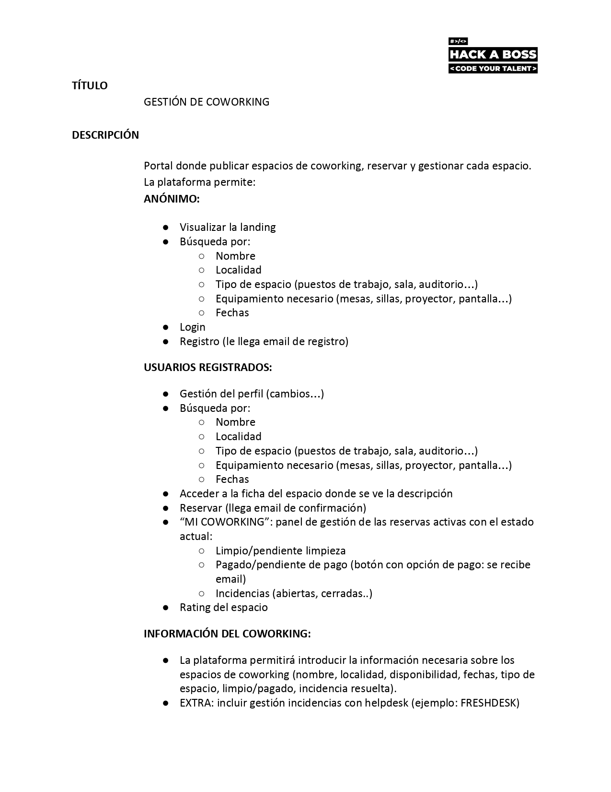

# Proyecto Hackaboss

Repositorio de mi proyecto: Gestion de coworking.

Portal donde publicar espacios de coworking, reservar y gestionar cada espacio de coworking.

## Entregas

[ ➤Base de datos](https://github.com/rubii9/ProyectoHAB/tree/master/SQL)

[ ➤Backend](https://github.com/rubii9/ProyectoHAB/tree/master/COWORK/Back)

[ ➤Frontend](https://github.com/rubii9/ProyectoHAB/tree/master/COWORK/Front)

## Descripción del proyecto

